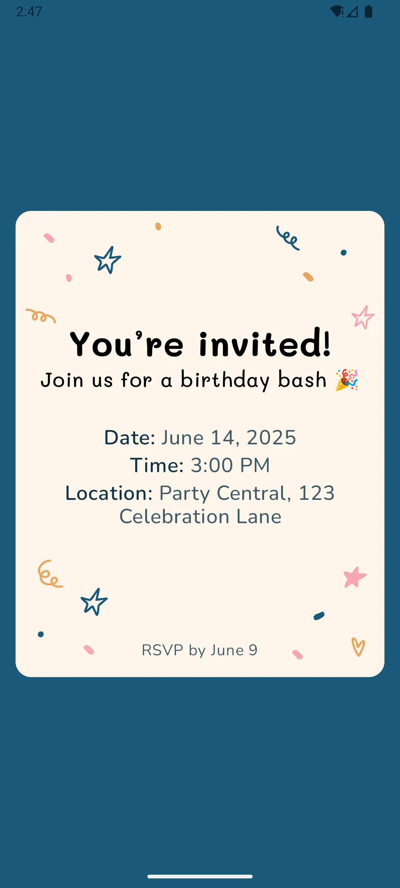
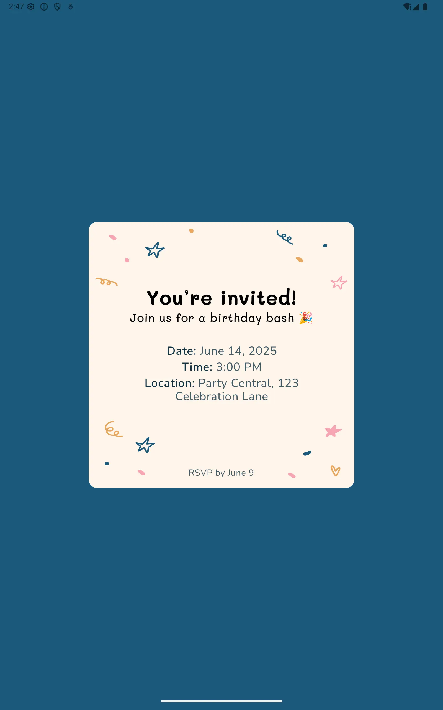
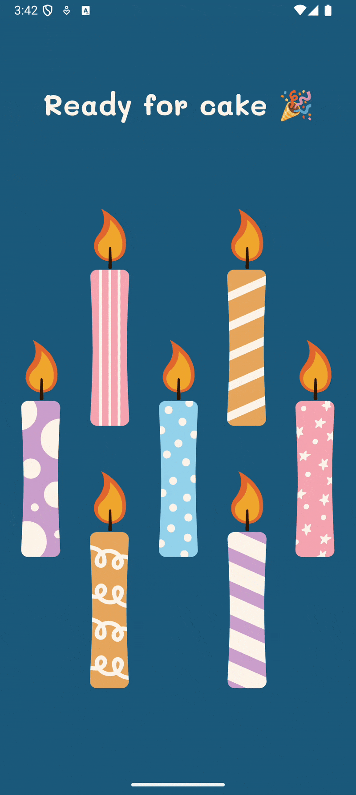
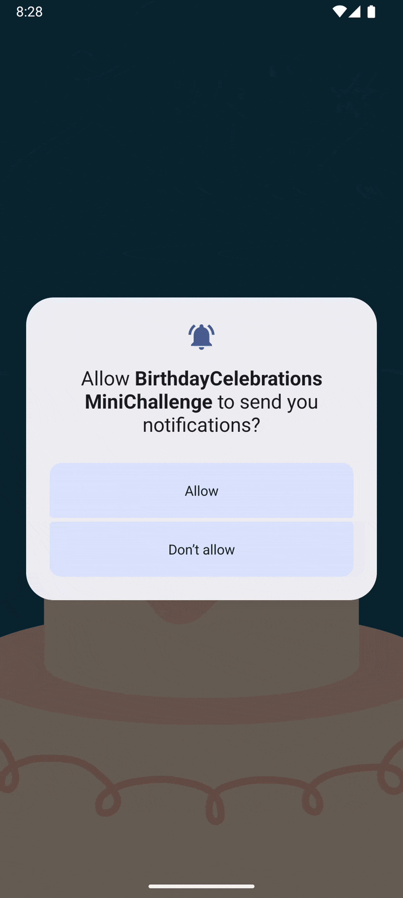

# 👩🏻‍💻📓✍🏻💡 Challenge Set - Jun 2025 - Birthday Celebrations

Part of the **Mobile Dev Campus Main App Challenge** by [Philipp Lackner](https://pl-coding.com/campus)

## Mini challenge 1 : [Easy] - Birthday Invitation Card
### 🎭 Scenario
You’re onboarding a new dev who swears by XML. To show them the glory of Jetpack Compose, you promise to recreate a simple birthday invite screen "without even opening a layout file." Now the pressure’s on — you need a clean layout that looks great.
### 🎯 Feature Goal
Build a static birthday invite screen using only Jetpack Compose layout elements.
### 🎥 Demo

---

## Mini challenge 2 : [Easy] - Cake Lighting Controller
### 🎭 Scenario
You’re building a prototype for a smart birthday cake. Yes, really. The client insists it’s the future: a cake where each candle is toggled digitally — no fire hazards, no spit. Your job? The UI. Each candle has to be individually switchable, and the app should show how many are currently "lit." It’s absurd, it’s oddly fun, and it’s your challenge now.
### 🎯 Feature Goal
Create a candle panel where toggled-off candles automatically relight themselves after a short delay.
### 🎥 Demo

---

## Mini challenge 3 : [Easy] - Countdown to cake
### 🎭 Scenario
You’re building a birthday countdown app for a very punctual party planner. They want users to press a button, wait a few suspenseful seconds, and then get a celebratory notification that it’s cake time. Oh — and of course, users should be able to cancel the countdown. Because sometimes, the cake isn’t ready yet.
### 🎯 Feature Goal
Let users start a countdown that triggers a birthday notification after a few seconds — unless they cancel it first.
### 🎥 Demo

---

## 🧠 What I put in practice

- Layouts with Jetpack Compose **adaptive layouts**, **adaptive navigation**, **animations**, **constraint layout in compose**, **edge-to-edge UI**, .
- Show **system notifications**
- Handle side effects using **LaunchedEffect**

---

## 📜 License

This project is open-source and free to use. Attribution appreciated! 🙌

---

## 🤝 Acknowledgements

Special thanks to [Philipp Lackner](https://pl-coding.com/campus) and the **Mobile Dev Campus** community for inspiring this mini challenges and helping sharpen real-world development skills.

---
